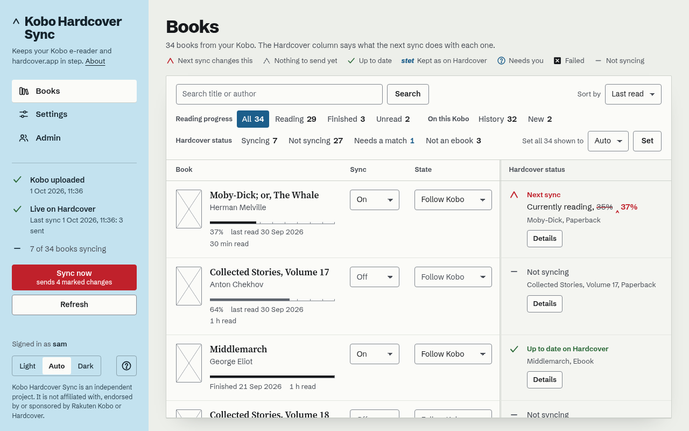
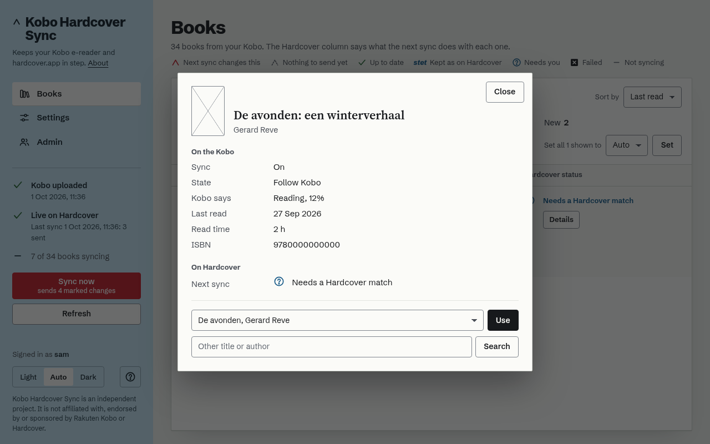
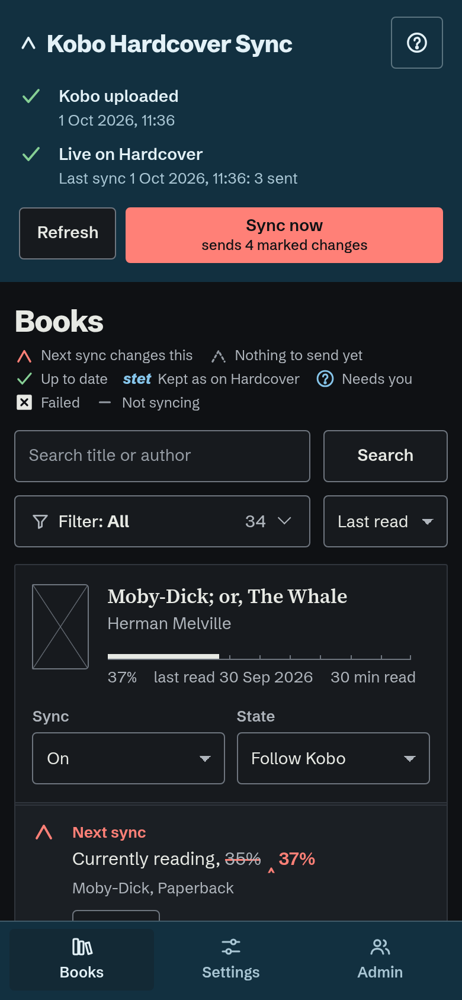

# kobo-hardcover-sync


Keeps your shelf on [Hardcover](https://hardcover.app) in step with what
you read on a **Kobo e-reader**: which books, how far, finished when. It
works with the Kobo as it comes, with books bought in the **Kobo store**.

Plug the Kobo into your computer and it syncs. Nothing is installed on the
Kobo, and nothing about how you read changes.





> **Beta.** It has been used daily on one Kobo and one Mac. It can write
> one thing to your Kobo, a collection, and only if you ask for it; see
> [what is written to the Kobo](#the-collection-on-the-kobo). Read that
> part before you give the collection a name.

An independent project: not affiliated with, endorsed by or sponsored by
Rakuten Kobo or Hardcover.

## What it does

- Reads the Kobo's own database when the Kobo is plugged in. That is the
  only place a stock Kobo keeps your reading; Kobo's cloud has no public
  API.
- Sends **status, progress and dates** to Hardcover for the books you
  switched on. A book you finished becomes *Read* with its date; a book
  you are reading becomes *Currently reading* with how far you are.
- Starts as a **dry run**: it shows what it would send, and sends nothing
  until you say so.
- **Never guesses a match.** A book it cannot place on Hardcover by ISBN,
  or by title and author together, waits for you to choose. A translation
  is placed when Hardcover itself lists its title for the book.
- Takes over what you change on Hardcover (a status, a finish date, an
  edition) instead of overwriting it.
- Can put a **collection** of your synced books on the Kobo. Handy when a
  Kobo account is shared and the device lists everyone's books.
- Keeps your reading minutes, for a dashboard of your own if you have one.

It does not sync highlights, notes or ratings, and it does not manage
books: it works with whatever is on the Kobo.

Every rule it follows is written down, each with the test that holds it:
[docs/sync-rules.md](docs/sync-rules.md).

## Two ways to run it

- **On your own computer** (local mode). One reader, no server. A sync
  runs when you plug in the Kobo; a page in your browser shows your books
  when you ask for it.
- **On your own server, for a household** (server mode). Several readers,
  each with their own books and their own Hardcover account, behind the
  sign-in you already have. The computer the Kobo is plugged into sends
  the book list to the server.

Either way it is yours: there is no account with this project and no
service of its own.

## Is this the right tool for you?

There are other good ways to get reading progress onto Hardcover. As far
as their own documentation said on 2 October 2026:

| | What it needs | Choose it when |
|---|---|---|
| **kobo-hardcover-sync** | A computer to plug the Kobo into. Nothing on the Kobo. | You read Kobo-store books on an unmodified Kobo, or your Kobo's software is too new for the tools below. |
| [NickelHardcover](https://codeberg.org/StrayRose/NickelHardcover) | An add-on installed on the Kobo itself. Its README says firmware 5.x is not supported yet. | Your Kobo's firmware is supported and you are happy to modify the device. It syncs over Wi-Fi without a computer, and also does highlights, notes and reviews. |
| [KOReader with the Hardcover plugin](https://github.com/Billiam/hardcoverapp.koplugin) | KOReader on the device. KOReader cannot open the store's DRM books. | You read your own, DRM-free books in KOReader. |
| [Calibre-Web Automated](https://github.com/crocodilestick/Calibre-Web-Automated) | A Calibre library on a server that the Kobo syncs with. | Your books live in Calibre and reach the Kobo from there. |

## What you need

- A Kobo e-reader and its USB cable.
- A Mac, or a Linux computer with a desktop (GNOME, KDE and the like).
- A [Hardcover](https://hardcover.app) account.
- [Homebrew](https://brew.sh) on a Mac, or [uv](https://docs.astral.sh/uv/)
  on any computer, to install the tool.

What has been seen working with a real Kobo:

| | Tested |
|---|---|
| Kobo | Clara Colour, Kobo software 6.0.274403 |
| macOS 27, with a server | daily use since 1 October 2026 |
| macOS 27, local mode | a clean account, from this README: install, sync, uninstall (2 October 2026) |
| Desktop Linux | built and tested without a device; not yet with a real Kobo |

Syncing to Hardcover reads the Kobo and should work on other models and
software. Writing the collection is held back on any Kobo database version
that has not been tried: see below. If it works on yours, please say so in
an issue, with the model and the software version.

## Install and first run, on your own computer

On a Mac, with Homebrew:

```
brew install merlijntishauser/tap/kobo-hardcover-sync
```

On a Mac with Apple silicon and macOS 15 or newer that takes seconds:
Homebrew fetches a ready-made build. On other Macs it builds from source,
which takes several minutes. On any computer, with uv, which brings the
Python it needs:

```
uv tool install kobo-hardcover-sync
```

Then, either way:

```
kobo-hardcover-sync setup
kobo-hardcover-sync token
kobo-hardcover-sync open
```

1. **`setup`** makes the trigger that runs a sync when the Kobo is plugged
   in, and says what it did.

   On a Mac it builds a small app, `KoboHardcoverSync.app`, and that app
   needs one permission that macOS does not ask for by itself: **Full Disk
   Access**. System Settings, Privacy & Security, Full Disk Access, the
   plus button, then Cmd+Shift+G and the path `setup` printed. Without it
   the sync cannot read the Kobo.

   On Linux no permission is needed.

2. **`token`** connects the tool to your Hardcover account. It opens
   Hardcover in your browser; you approve there, Hardcover sends the
   browser back to the tool, and that is all. (No browser on this
   computer? `token --code` shows an address and a short code to approve
   from anywhere.) The tool may then read your
   profile name, the catalogue and your library, and change your library,
   and nothing more. The connection is kept in your computer's secret
   store (the Keychain on a Mac) and renews itself. You can end it with
   `token --remove`, or on Hardcover under your authorised apps.

   Would you rather hand it a token you made on Hardcover yourself?
   `kobo-hardcover-sync token --paste` asks for one and prints a link to
   Hardcover's page for making it, with the four permissions already
   ticked. Such a token stops working on the date you choose there.

3. **Plug in the Kobo** and tap *Connect* on it. The first sync reads your
   books.

4. **`open`** shows them in your browser. Everything you read before today
   is listed and switched *Off*: choose the books that are yours and switch
   them *On*. Books you open on the Kobo from now on switch on by
   themselves.

5. Look at what it would send. Fix the books that say *Needs a Hardcover
   match*. Then, under Settings, go **live**.



## Every day

Plug in the Kobo. A notification says what happened, for example:

> Kobo synced. 8 books updated.

That is all. Nothing runs in between: the sync starts when the Kobo is
mounted and exits when it is done. Run by hand in a terminal
(`kobo-hardcover-sync sync`), the same sync says what it did, as in the
picture at the top.

Open the page when you want to switch a book on or off, fix a match, set a
finish date, or see why something did not sync.

Other commands:

| | |
|---|---|
| `kobo-hardcover-sync sync` | One sync now, from a terminal: it says each step, then names the books that went to Hardcover. Without a Kobo it still exchanges changes with Hardcover (local mode). `--verbose` also shows the log as it runs. |
| `kobo-hardcover-sync status` | What is set up, the Kobo it sees, its model and software, the last message. Quick, and never uses the network. |
| `kobo-hardcover-sync doctor` | Checks everything a sync depends on and says what to do about what is wrong. Changes nothing. |
| `kobo-hardcover-sync open` | The page. |
| `kobo-hardcover-sync token --code` | Connect to Hardcover with a short code to approve, instead of in this computer's browser. |
| `kobo-hardcover-sync token --remove` | End the connection to Hardcover and go back to dry run. |
| `kobo-hardcover-sync export` | Your reading as JSON: every book on the Kobo you or anyone on the account opened, how far, the dates, minutes per day, and what syncs. For a database or a dashboard of your own; it works without Hardcover. `kobo-hardcover-sync export --output reading.json` writes a file only you can read; add `--every-sync` and that file is written again after every sync, for a dashboard to read. `kobo-hardcover-sync export --stop` ends that. The page has the same file under Settings, *Your reading as a file*. |
| `kobo-hardcover-sync webhook` | After every sync that read something new from the Kobo, a POST with JSON to an address of your own: a reading tracker, a database, an automation. https, an optional Bearer token kept in the Keychain, and a test before anything is stored. See [docs/webhook.md](docs/webhook.md). |
| `kobo-hardcover-sync uninstall` | Remove the trigger. `--purge` also removes the state and the tokens. |



## The collection on the Kobo

Optional. Give the collection a name under Settings and the Kobo gets a
collection holding the books that sync. This is **the only thing this tool
ever writes to your Kobo**. Without a name, it writes nothing at all.

What is written, and how:

- Only a collection this tool made itself. A collection of yours is never
  touched, also when it has the same name.
- Only when the list changed.
- In one step that happens completely or not at all.
- After a copy of the Kobo's whole database was saved on your computer.
  The last three copies are kept.
- The collection is the tool's: a book you add to it on the Kobo is taken
  out again. Another name under Settings replaces the old collection at
  the next plug-in; clearing the name removes it.

**A gate comes before all of that.** The Kobo's database says which version
it is. A version nobody has tried is refused: nothing is written, not even
the copy, and the message names the version. Syncing to Hardcover goes on
as usual.

| Kobo software | Database version | Seen working |
|---|---|---|
| 6.0.274403 | 222 | 1 October 2026, one device |

To try another version on purpose, put `allow_untested_kobo = true` in
`config.toml` in the tool's folder. Even then it refuses a database that
lacks a column it writes, or that has one it does not know how to fill in.
If it works, please report the versions.

**Always eject before unplugging** after a notification says the collection
changed.

### If something looks wrong on the Kobo

1. The gentle way: delete the collection on the Kobo itself (*My Books*,
   *Collections*). Your books and your reading are not part of it. Clear
   the name under Settings if you do not want it back.
2. The whole database back, as it was before the write. Plug in the Kobo,
   then on a Mac:

   ```
   cd ~/Library/Application\ Support/kobo-hardcover-sync/collection/backups
   gunzip -c KoboReader-<date>.sqlite.gz > /Volumes/KOBOeReader/.kobo/KoboReader.sqlite
   ```

   Eject, then unplug. Everything on the device goes back to that moment,
   reading positions included; for Kobo-store books the Kobo fetches the
   newer positions from your account at its next sync.

## For a household, on your own server

The server holds the books and the settings of every reader, and talks to
Hardcover for each of them. It has **no login of its own**: it sits behind
a sign-in proxy you already run (forward authentication) and believes the
`Remote-User` header only from that proxy's address.

```
mkdir kobo-hardcover-sync && cd kobo-hardcover-sync
curl -fsSLo docker-compose.yml https://raw.githubusercontent.com/merlijntishauser/kobo-hardcover-sync/main/examples/docker-compose.example.yml
python3 -c "import base64,os;print('KHS_SECRET_KEY='+base64.urlsafe_b64encode(os.urandom(32)).decode())" > .env
chmod 600 .env && mkdir -p data
docker compose up -d
```

That runs the published image, `ghcr.io/merlijntishauser/kobo-hardcover-sync`
(amd64 and arm64). Look through `docker-compose.yml` before the last
line: it has two addresses that are yours to fill in. To build the image
yourself, clone the repository and put `build: .` in place of the `image:`
line.

- Set `KHS_TRUSTED_PROXIES` in the compose file to the address your proxy
  connects from. The server refuses to start without it, and answers 403
  to anyone else who sends a `Remote-User` header. Publish the port only
  where the proxy can reach it.
- Open the page through the proxy and press *Start using Kobo Hardcover
  Sync*. The first reader is the admin. Everyone else the proxy lets in
  signs up with one click and starts in dry run.
- Each reader connects to their own Hardcover account under Settings
  (*Connect to Hardcover*: a link and a short code, approved on Hardcover).
  What the server keeps for that is encrypted in the database with
  `KHS_SECRET_KEY`; keep that key out of the data folder and its backups.
- `/upload` and `/collection` are for the computers that send a Kobo's
  books: route them past the sign-in, because they carry a token of their
  own. `/api/stats/<reader>` gives reading minutes and the current book to
  a dashboard, once that reader made a stats token under Settings.
  Each reader can download their whole shelf as JSON under Settings, *Your
  reading as a file*, behind the sign-in; `kobo-hardcover-sync export
  --reader NAME`, run on the server, gives the same.

On the computer the Kobo is plugged into:

```
kobo-hardcover-sync setup --server https://kobo.example.org
```

`setup` makes an upload token, keeps it in the secret store and prints its
SHA-256. Paste that hash on the page under Settings, Devices. The hash
alone cannot upload anything.

Settings of the server, as environment variables: `KHS_DATA`, `KHS_HOST`,
`KHS_TRUSTED_PROXIES`, `KHS_SECRET_KEY`, `KHS_INTERVAL` (seconds between
syncs with Hardcover, 0 for never), `KHS_MAX_UPLOAD_MB`,
`KHS_SNAPSHOT_DAYS`, `KHS_COVER_URL`, `KHS_LOG` (`verbose` for a line per
book in the server's log, with book titles), and `TZ` for the time zone.

## Privacy

There is no telemetry, no update check and no account with this project.
This is everything that leaves the computer it runs on.

**To Hardcover**, with your token:

- to find a book: its ISBN, or its title and author. Only for books that
  are switched on, and for a search you type yourself;
- for those books: the status, how far you are, and the dates.

**To Kobo's cover server**: the cover number of each book the page shows.
The tool fetches the cover once and keeps it; your browser talks to the
tool only.

**In server mode, from the computer to your own server**: for every book
on the Kobo, the title, author, ISBN, progress, dates, cover number and
language, and the times books were opened on that Kobo. On a shared Kobo
account that includes the books of the others on the account; each reader
decides which are theirs. The server keeps what was uploaded for 90 days.

**Never, in either mode**: the Kobo account's login tokens, the keys of
your books, reviews, wishlist or anything else in the Kobo's database. The
upload is built from a list of what is needed, and the server refuses an
upload that holds more.

**To your own webhook**, if you set one: the book you are reading, the
books that changed in that sync, and your reading minutes, to the address
you gave and nowhere else (no redirect is followed).

**Where you ask for it**: `export` writes your reading, titles included,
to the screen or to the file you name (after every sync, if you asked for
that), and nowhere else.

Your connection to Hardcover (or a token you pasted) is kept in your
computer's secret store (local mode) or encrypted in the server's database
(server mode). It is never shown again, never logged, and never put on a
command line. Disconnecting ends it at Hardcover too.

## Limits worth knowing

- The Kobo has to be plugged into a computer. There is no sync over Wi-Fi.
- Edits you make on Hardcover are seen at the next sync, not at once.
- Finish dates are the Kobo's own, which are in UTC: a book finished just
  after midnight can carry the day before. Set the date on the page when
  it matters.
- Two copies of one book on the Kobo (a sample and the book, two editions):
  the copy you read last speaks for the book on Hardcover.
- Books you put on the Kobo yourself can sync to Hardcover, but are not put
  in the collection.
- A very large first sync can take more than a day: Hardcover allows 5000
  requests a day. It carries on at the next sync.

The full list is at the end of [docs/sync-rules.md](docs/sync-rules.md).

## When something does not work

Start with `kobo-hardcover-sync doctor`. It looks at everything a sync
depends on (the setup, the trigger, the Kobo and its database, your
Hardcover token, the collection, the backups), changes nothing, and says
per item what it found and what to do:

```
Your Kobo
  ●  Kobo           Found at /Volumes/KOBOeReader (Kobo Clara Colour, software
                    6.0.274403).
  ●  Database       The Kobo's database can be read: 412 books on it.

Hardcover
  ✗  Hardcover      Hardcover does not accept your token. It has expired, was
                    removed or is not complete: make a new one on Hardcover and
                    put it under Settings.
  ○  Sending        Dry run: the page shows what would be sent, and nothing
                    goes to Hardcover.
                    Go live under Settings when the plan looks right.

1 problem: its line says what to do.
```

In a terminal the marks are coloured as on the page: green for fine, amber
for something that needs you, red for a problem, grey for a note. Piped
into a file or pasted into a bug report, the same lines carry the word
instead (`ok`, `note`, `warning`, `problem`), and `NO_COLOR` switches the
colour off.

The page has the same check under Settings, in the *Check* card. With a
server each side sees its own half: the card on the server's page checks
your token, Hardcover and what was uploaded; `doctor` on the computer
checks the Kobo and whether the server knows that computer.

The log is `agent.log` in the tool's folder:
`~/Library/Application Support/kobo-hardcover-sync/` on a Mac,
`~/.local/share/kobo-hardcover-sync/` on Linux. It holds what happened in
counts and messages, and no book titles. For a line per book, run
`kobo-hardcover-sync sync --verbose` once, or put `verbose_log = true` in
`config.toml` in that folder to have it for every sync. **A verbose log
contains your book titles**: read it before you share it. Neither log ever
holds a token.

| You see | What to do |
|---|---|
| Nothing happens when the Kobo is plugged in | Tap *Connect* on the Kobo. On a Mac, check that `KoboHardcoverSync.app` has Full Disk Access. Run `kobo-hardcover-sync sync` in a terminal to see the message. |
| "macOS does not let the tool read the Kobo. Give KoboHardcoverSync.app Full Disk Access ..." | Give the app the permission (step 1 above). If you rebuilt the app, remove its old entry there first and add it again. |
| "The Kobo was unplugged during the sync" | Plug it in again. Nothing on the Kobo was changed; what was already sent to Hardcover stays sent. |
| "The Kobo's database is in use by another program" | Close Calibre, the Kobo desktop app or anything else that reads the Kobo, and plug it in again. |
| "Nothing new." | The Kobo is as it was at the last sync. Read a page and plug it in again. |
| "Hardcover no longer accepts this connection. Connect again under Settings" | The connection was ended on Hardcover, or went unused for six months. Connect again: `kobo-hardcover-sync token`, or Settings on a server. |
| "Hardcover does not accept your token" | A pasted token expired or was removed. Connect instead (`kobo-hardcover-sync token`, or Settings), or paste a new one. |
| "Your Hardcover token may not do this (it lacks: ...)" | The token was made without one of the four permissions. Make a new one with the link the tool gives. |
| *Needs a Hardcover match* on a book | Open its Details and choose the right book, or search for it there. |
| "Collection not updated: This Kobo's software has not been tested ..." | Your Kobo's software has not been tried yet. Syncing to Hardcover still works. See [the collection](#the-collection-on-the-kobo). |
| "Something went wrong that this tool did not expect" | A bug. The details are in `agent.log`; please [report it](https://github.com/merlijntishauser/kobo-hardcover-sync/issues) with the output of `doctor`. |
| "None of the N books this tool put on your Hardcover shelf are on the shelf ..." | The token belongs to another Hardcover account, or you emptied the shelf yourself. Nothing was switched off. Fix the token, or switch those books off on the page. |
| "Hardcover could not be reached" or "Today's number of requests ... is used up" | Nothing is lost. The next sync carries on. |
| The server answers 403 to everything, or does not start | `KHS_TRUSTED_PROXIES` does not name the address your proxy connects from. |

On Linux, a Kobo mounted somewhere unusual is found when `KHS_VOLUMES`
names the folder above it. Without a desktop keyring the tokens are kept in
a file only you can read; `status` says which.

## Uninstall

```
kobo-hardcover-sync uninstall --purge
brew uninstall kobo-hardcover-sync        # or: uv tool uninstall kobo-hardcover-sync
```

Run the first line first: it removes the trigger, and with `--purge` your
books, settings and tokens on this computer. Without `--purge` they stay.

On a Mac, remove the app's entry under Full Disk Access by hand. A
collection it made stays on the Kobo until you delete it there; clearing
its name under Settings before you uninstall removes it at the next
plug-in.

## More to read

- [docs/sync-rules.md](docs/sync-rules.md): every rule, and the test that
  holds it.
- [docs/how-it-works.md](docs/how-it-works.md): the parts, and why it is
  built this way.
- [docs/local-mode.md](docs/local-mode.md): local mode in detail.
- [docs/hardcover-api.md](docs/hardcover-api.md): what Hardcover's API asks
  of a tool like this.
- [docs/webhook.md](docs/webhook.md): the webhook, and the JSON it sends.
- [CONTRIBUTING.md](CONTRIBUTING.md), [SECURITY.md](SECURITY.md),
  [CHANGELOG.md](CHANGELOG.md).

## What 1.0 would need

This is 0.1: it works for the one household it was built in. Before it is
called 1.0:

- more than one Kobo model and more than one software version confirmed,
  for syncing and for the collection;
- local mode on a Mac and the Linux desktop seen working with real Kobos,
  by more people than its author;
- a season of use without a damaged Kobo database, on more than one
  device;
- Hardcover's API out of beta, or its changes handled as they came.

## AI disclaimer

Yes, LLMs and coding agents are (and will be) used in this project. We
integrate AI carefully and responsibly, and never in a way that compromises
data integrity, privacy, or security.

Please be responsible and transparent when using AI tools, and always put
user privacy and data security first.

When you submit a PR, make sure you fully understand what the code does and
what it might affect. Keep PRs small, and always run the tests before
opening or updating one.

And a small personal note: using AI tools doesn't mean this project didn't
take a lot of time and effort. Built with care, and with real appreciation
for [Hardcover](https://hardcover.app) and the people who build it: a place
for readers that is open enough to let a tool like this exist. And Kobo:
great e-readers, but finally give us a family account!

## Licence

The code, the documentation and the icon are under the [MIT licence](LICENSE).

One kind of file in this repository is not, and keeps its own licence: the
two fonts (SIL Open Font License 1.1). What that means, where their licence
texts are, and the licences of the Python packages installed next to the
tool:
[THIRD-PARTY-NOTICES.md](THIRD-PARTY-NOTICES.md).
